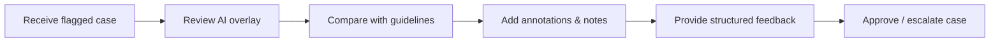

# 🧑‍🔬 MediBridge Training – Specialists

This training module is designed for **specialists** (senior radiologists, consultants) who validate and review cases flagged by AI or clinicians.  
It focuses on quality assurance, second opinions, and advanced interpretation.

## 🎯 Purpose
- Train specialists to review AI‑flagged cases  
- Ensure consistency with clinical guidelines  
- Provide structured feedback to clinicians  

## 🩺 Case: Male with suspicious areas
- Case flagged by AI as requiring specialist review  
- Specialist examines scan, validates AI findings, and compares with guidelines  
- Adds annotations and structured notes for the clinician  

## 🔄 Training Flow

## 📈 Outcome
Specialists practice:

- Validating AI findings
- Applying guidelines consistently
- Communicating clear feedback to clinicians
